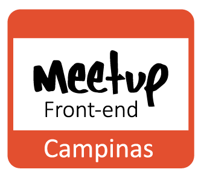

======

* [Apresentação do Meetup](#)
* [Meetups já realizados](meetups.md)

_"De todos para todos!"_

A idéia do [Campinas Front-end Meetup](http://www.meetup.com/pt/Campinas-Front-End-Meetup/), é bastante baseada e inspirada pelo [CSS SP](http://www.meetup.com/css-sp).

Nosso objetivo é aumentar e fortalecer a comunidade de desenvolvedores web de Campinas e região, além de encorajar e ajudar profissionais que estão começando. É organizado atualmente por mim ([Gabriel Ribeiro](https://twitter.com/BielRibeiro1990)) e pelo [Victor Miguez](https://twitter.com/_vmiguez) com a ajuda do [Rodolfo Pereira](https://twitter.com/rodolfoprr) e do [Felipe Mattos](https://twitter.com/IAMFELIPEMATTOS).
O objetivo do repositório é reunir as principais informações, como links, fotos e palestras sobre os meetups.

* [Meetups](meetups.md)
* [Locais](#locais)
* [Como participo?](#como-participo)
* [Quero apresentar algo!](#quero-apresentar-algo)

## Locais

Se você estiver disposto a nos ajudar com locais para os _meetups_ fique a vontade. :v: Não existe um padrão definido, mas acreditamos que para o _meetup ficar bacana, o local precisa:

* Ter suporte para pelo menos dez pessoas.
* Caso o _meetup_  esteja programado com palestras, ter suporte para isso, como um projetor e se for preciso microfone.
* O *coffee* não é obrigatório. A empresa que oferecer o espaço pode patrocinar também o coffee break. Caso contrário, os organizadores vão providenciar, seja por meio de outro patrocínio, ou uma ajuda simbólica para os partipantes do _meetup_. O *coffee* deve ser algo secundário em relação ao encontro e não o principal.

Animou? Envie um e-mail pra gente _biel.ribeiro1990@gmail.com_ e _victorcineis@gmail.com_.

## Como participo?

Se cadastre no site do [Meetup](http://www.meetup.com/) e se inscreva no [Campinas Front-end Meetup](http://www.meetup.com/pt/Campinas-Front-End-Meetup/). Lá estaremos divulgando as informações referentes aos próximos _meetups_.

## Quero apresentar algo!

Tem vontade de apresentar uma talk sobre algum assunto de CSS? Ou tem algum bug que não consegue resolver e quer pedir uma força pra galera? Ou simplesmente viu algum link legal e quer divulgar pro pessoal discutir? Maravilha. [Envie algumas informações pra gente através desse link](https://docs.google.com/forms/d/1OGG75DrwK7hw3WJ4QGT5ruvnwcgI2AGe44pp5PrkNPc/viewform) e assim que tivermos o próximo _meetup_ confirmado, iremos entrar em contato pra verificar sua disponibilidade na data do evento.

## Agradecimentos

### Logo

O logo foi desenvolvido pelo [Lucas Lorençon]() e gostaríamos de agradecer imensamente pela ajuda.

### Empresas parceiras

Quem já nos ajudou :metal:

* [Princi Web](http://www.princiweb.com.br/)
* [Minha Campinas](http://minhacampinas.org.br/)
* [Navegar/Digitale](http://www.digitale.com.br/)
